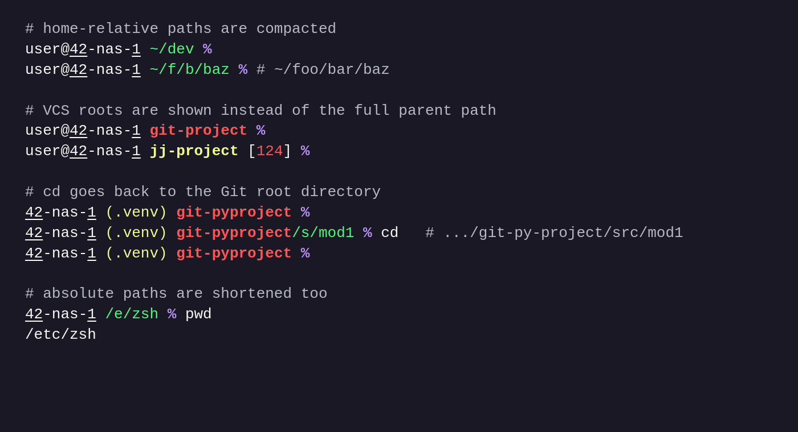

# rs-prompt

`rs-prompt` is a small shell prompt generator in the spirit of suckless tools:
configuration lives in the source code, then the binary is rebuilt and installed.

The prompt shape is:

```text
(user@)?host (virtualenv)? path [status]? (%|$|#)
```



The overview uses sanitized demo values.

It supports Zsh and Bash init snippets, VCS-aware path rendering for Git, Jujutsu,
and repo worktrees, virtualenv display, and shell-safe prompt escaping.

## Disclaimer

Fully written using Codex in Rust from a zsh shell version.

## Configure

Edit the source, rebuild, and reinstall.

- Colors: `src/ansi.rs`
- Host formatting: `src/host.rs`
- Path shortening and VCS path rendering: `src/path.rs`
- VCS marker detection: `src/vcs.rs`
- Virtualenv name display: `src/venv.rs`
- Prompt layout, status, user display, and end marker: `src/prompt.rs`
- CLI flags and init script embedding: `src/main.rs`
- Zsh integration: `scripts/init.zsh`
- Bash integration: `scripts/init.bash`

For example, to hide your normal login name, add it to `HIDDEN_USERS` in
`src/prompt.rs`, then rebuild.

## Build

```sh
cargo build
cargo test
```

For a release binary:

```sh
cargo build --release
```

## Install

```sh
cargo install --path .
```

Or copy the release binary yourself:

```sh
mkdir -p "$HOME/.local/bin"
cp target/release/rs-prompt "$HOME/.local/bin/rs-prompt"
```

## Shell Setup

Zsh:

```sh
eval "$($HOME/.local/bin/rs-prompt init zsh)"
```

Bash:

```sh
eval "$($HOME/.local/bin/rs-prompt init bash)"
```

## Development

```sh
just check
```

The Python tests live under `tests/`:

```sh
(cd tests && uv run pytest -q)
(cd tests && uv run ruff check .)
(cd tests && uv run black --check .)
(cd tests && uv run isort --check-only .)
```
